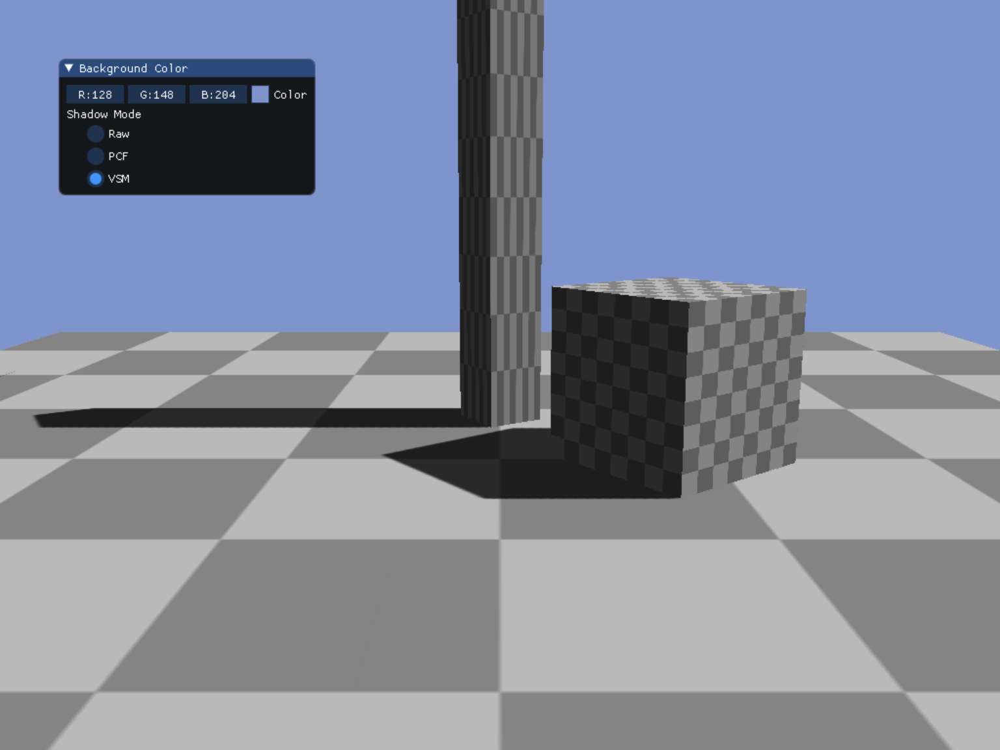

# DX12图形练习仓库

此项目为一个基于DirectX 12的、以学习图形算法为目的的渲染器（和朋友[GraphicsMe](https://github.com/GraphicsMe)一起开发实现的）。

工程开发方面，完成了：

- DirectX 12图形API封装（参考[MiniEngine](https://github.com/microsoft/DirectX-Graphics-Samples)）
- 简易应用框架
- 基础数学库
- obj模型加载
- ...

图形算法方面，实现了一些常用的实时渲染算法：

- 延迟渲染；
- IBL；
- PBR；
- 球谐光照（Spherical Harmonics Lighting）；
- 阴影（Shadow Mapping）；
- 基于时间的抗锯齿算法（TAA）；
- 泛光（Bloom）；
- 景深（DOF）；
- 色调映射（ToneMapping）；
- 基于LTC的面光源渲染；
- 皮肤渲染；
  - 基于预积分的皮肤渲染；
  - SSSS；
- 环境光遮蔽（Ambient Occlusion）；
  - SSAO
  - HBAO
  - GTAO
- 屏幕空间反射（SSR）；

- ...

并在[CSDN博客 - 黑键](https://blog.csdn.net/qjh5606)输出了部分对应的笔记。

部分示例
=================

- [Shadow Mapping](#shadow-mapping)

* [IBL Maps Generator](#ibl-maps-generator)
* [IBL+PBR](#iblpbr)

- [TAA](#taa)
- [LTC](#ltc)
- [Skin Rendering](#skin-rendering)
- [Ambient Occlusion](#ambient-occlusion)

## Shadow Mapping

笔记：

- [黑键 - 实时阴影渲染](https://blog.csdn.net/qjh5606/article/details/120070553)

**VSM（Variance shadow maps）**

## IBL Maps Generator

笔记：

- [黑键 - PBR回顾](https://blog.csdn.net/qjh5606/article/details/118558172)
- [黑键 - 球谐光照](https://blog.csdn.net/qjh5606/article/details/118444249?spm=1001.2014.3001.5501)

示例结果：预计算生成Irradiance Map、Prefiltered Environment Map、Preintegrated BRDF三种贴图，以及三阶SH系数。

**Preintegrated BRDF**

**Prefiltered Environment Map**

- 预过滤环境贴图，其中的一级Mip。

**基于预积分的IrradianceMap**

**基于三阶SH的Irradiance Map**

## IBL+PBR

笔记：

- [黑键 - PBR回顾](https://blog.csdn.net/qjh5606/article/details/118558172)
- [黑键 - 泛光（Bloom）](https://blog.csdn.net/qjh5606/article/details/119005531)
- [黑键 - 景深效果（DOF）](https://blog.csdn.net/qjh5606/article/details/118960868)
- [黑键 - 屏幕空间反射（SSR）](https://blog.csdn.net/qjh5606/article/details/120102582)

示例最终包含IBL、PBR、Bloom、SSR等渲染效果。

## TAA

笔记：

- [黑键 - 抗锯齿（Anti-Aliasing）](https://blog.csdn.net/qjh5606/article/details/118827463)

**关闭TAA**：

**开启TAA**

**相机和物体运动情况下的TAA效果**

- [TAA的动态效果](https://www.bilibili.com/video/BV1aA411c7nc)

## LTC

笔记：

- [黑键 - 基于LTC的面光源渲染](https://blog.csdn.net/qjh5606/article/details/119682254)

**常量面光源**

**纹理面光源**

## Skin Rendering

笔记：

- [黑键 - 皮肤渲染](https://blog.csdn.net/qjh5606/article/details/119820942)

**基于预积分的皮肤渲染**

预积分查找表

渲染效果

**基于模糊的皮肤渲染**：

## Ambient Occlusion

笔记：

- [黑键 - 环境光遮蔽（Ambient Occlusion）](https://blog.csdn.net/qjh5606/article/details/120001743)

**SSAO**

**HBAO**

**GTAO**

